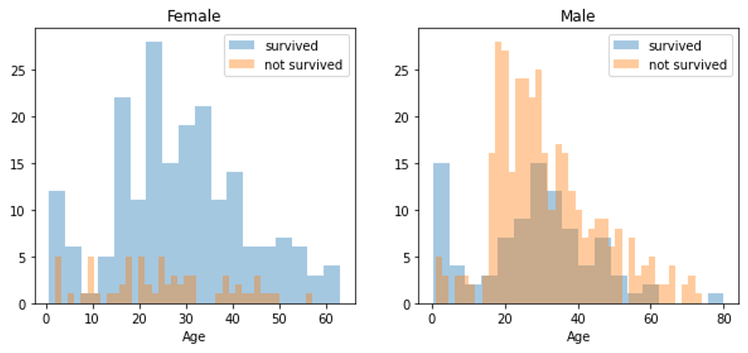
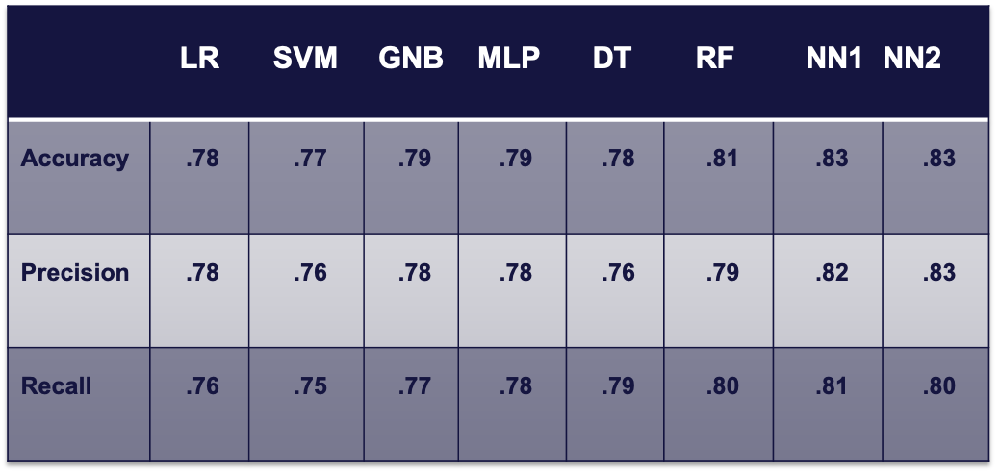

# Project 2: Sink or Swim

## Team: 
Floriane Beyegue, Josh Jagget, Cassandra Johnson, Antonio Pinkston, and Rajiv Shrestha

## Overview 

Our group initially wanted to do a project that took sentiment scores from news stories about the election to see if this information could be used to predict stock market performance. However, we ran into challenges pulling a prolonged history of news stories for free with various APIs and being able to incorporate this into a ML model.  We ultimately changed our project to use data on Titanic passengers to predict the passengers' likelihood of survival.  

We decided to run multiple ML models and compare the results of several models to determine the most effective and accurate model. The data was sourced from Kaggle as a part of their Titanic ML competition and was separated into two datasets--a training and a testing csv. Both datasets had the same features--survival, pclass, sex, age, number of siblings & spouses, number of parents & children, ticket number, fare price, cabin number, and lastly, port of embarkation--with survival being excluded from the testing dataset. We opted to only use survival, pclass, sex, age, number of siblings & spouses, number of parents & children, fare price, and port of embarkation for our analysis. We elected to use the training dataset to build our models with the goal of predicting survival in the testing dataset. The Neural Network model with multiple layers proved to be the most effective model in predicting survival. 

## Data Analysis 
Using the training dataset, we conducted statistical analysis to identify characteristics of the ideal survivor and determine that 38.4% of passengers survived. Next, we pinpointed which features provided useful information in predicting survival. This allowed us to remove the Passenger ID, Name, Ticket, and Cabin fields. Lastly, we identified nulls and imputed them using the average value of a given field. This allowed for a more complete picture of the defining characteristics and provided us with a new training dataset to complete our machine learning analyses.

### Survival Distribution Across Sex

## Models used and Conclusion 
In order to predict overall survival in the testing dataset, we needed to use the training dataset to determine which ML model would predict survival most accurately. Thus, we utilized logistic regression, Support Vector Machine (SVM), Decision Trees, Random Forest, GaussianNB, MlpClassifier, and various Neural Network models. Each model utilized the same 10 features and 1 target variable (Survival). To achieve uniform train-test splits, all models were run with a random state of 78. Of our 8 models, the neural network 2 with more hidden layers proved to be the most correct at predicting survival with an 83% accuracy score. We then ran this model against our testing dataset and achieved a survival rate of 38.5%, which is within 0.1% of the survival rate achieved using statistical analysis. 

### Model Performance

## Dependencies 

To run our code, you will need to install the following packages not previously used in class: 

Yellowbrick: pip install yellowbrick 
